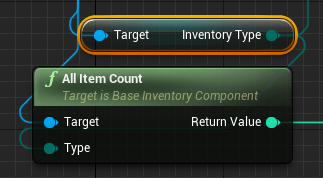

# ALLItemCount

## 格式

```C++
int32 AllItemCount(EInventoryType Type);
```

## 简介

<span style="padding: 4px 6px; font-size: 12px; display: inline-block; color: #FFFFFF; background: #FFC547;">函数</span>

​	获取指定背包类型中的所有道具数量。

## 参数

| 名称 | 类型           | 缺省 | 是否输出 | 描述                        |
| ---- | -------------- | ---- | -------- | --------------------------- |
| Type | EInventoryType |      |          | 背包类型，不可以填写All类型 |

## 返回值

| 类型  | 描述                                                  |
| ----- | ----------------------------------------------------- |
| int32 | 背包中的道具数量，若此仓库中没有此类型的背包，则返回0 |

## 调用位置

​	DS和Client均可。

## 实例

