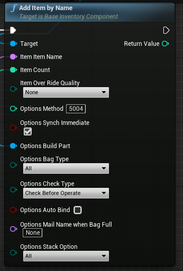

# AddItemByName

## 格式

```C++
virtual int32 AddItemByName(const FItemDef& Item, FItemOperateOptions Options );
```

## 简介

<span style="padding: 4px 6px; font-size: 12px; display: inline-block; color: #FFFFFF; background: #FFC547;">函数</span>

​	根据道具定义结构体添加指定数量的道具。

## 参数

| 名称    | 类型                | 缺省 | 是否输出 | 描述                   |
| ------- | ------------------- | ---- | -------- | ---------------------- |
| Item    | FItemDef            |      |          | 道具的定义模板结构体   |
| Options | FItemOperateOptions |      |          | 道具添加时的操作结构体 |

## 返回值

| 类型    | 描述       |
| ------- | ---------- |
| ErrorID | 通用错误码 |

## 调用位置

​	只能在DS上调用。

## 实例



